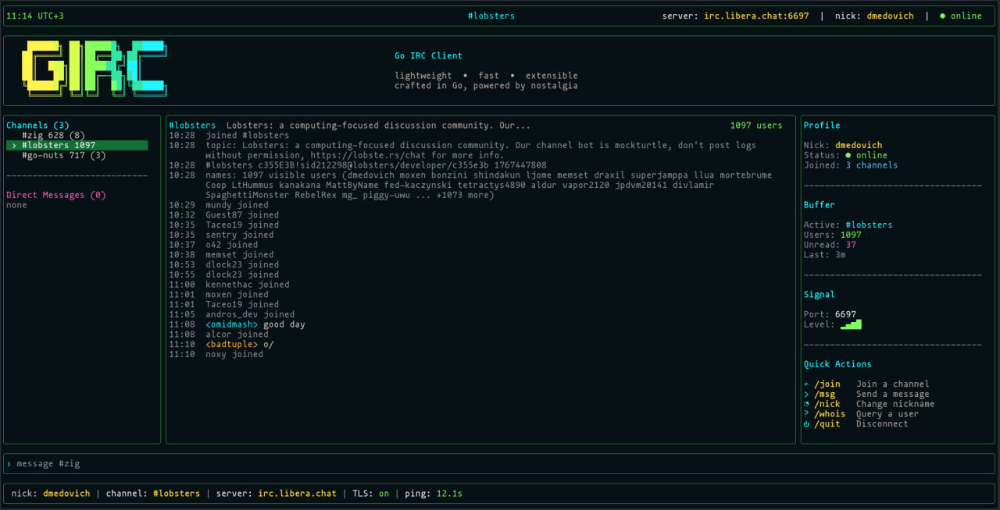

# girc - just irc tui client



## Run

```sh
go run ./cmd/girc
```

Join a single channel:

```sh
go run ./cmd/girc -server irc.libera.chat -channel '#zig'
```

Join several channels:

```sh
go run ./cmd/girc -channels '#zig,#lobsters,##rust,#go-nuts'
```

## Config

`girc` loads the nearest `.env` from the current directory or its parents.

```sh
cp .env.example .env
$EDITOR .env
go run ./cmd/girc
```

TLS is enabled by default on port `6697`. Use `-plain -port 6667` only for
plaintext IRC servers.

For SASL login, set your NickServ account and password:

```sh
GIRC_NICK=YourNick GIRC_SASL_USER=YourNick GIRC_SASL_PASS='your-password' go run ./cmd/girc
```

## Commands

- `/connect host[:port] [nick]`
- `/join #channel`
- `/part [#channel]`
- `/msg nick message`
- `/ns NickServ-command`
- `/me action`
- `/nick newnick`
- `/whois nick`
- `/switch buffer-or-number`
- `/raw COMMAND`
- `/quit [message]`

Use `Tab` and `Shift+Tab` to switch buffers.
